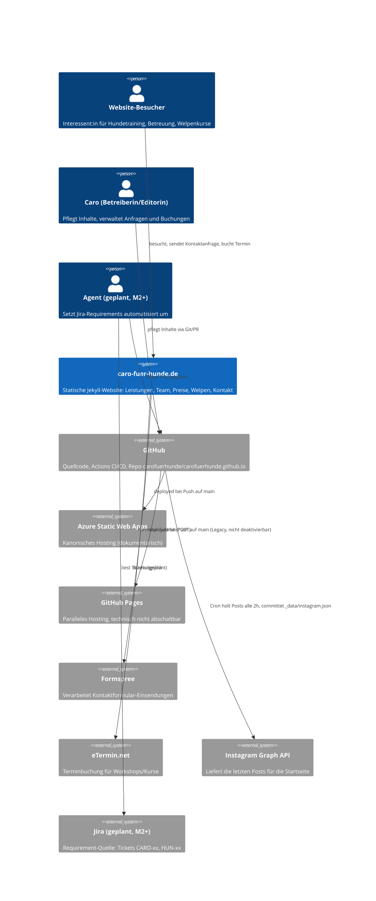
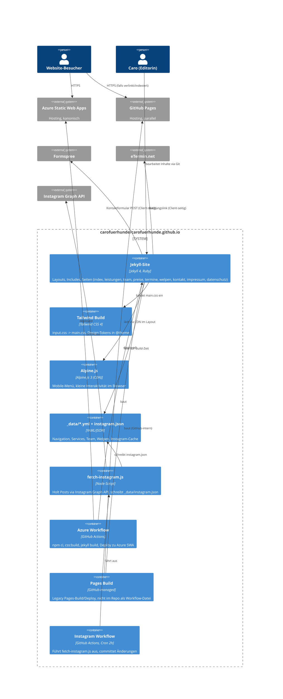

# Architektur

Leichtgewichtige C4-Dokumentation (Context + Container) für `carofuerhunde/carofuerhunde.github.io`. Stand: 2026-07-23. Kein voller arc42-Kapitelsatz — proportional zu einer kleinen statischen Marketing-/Info-Website.

## Context

Wer nutzt das System und mit welchen externen Systemen spricht es.

## Container

Wie das System intern aufgebaut ist.

## Hinweise zu den Diagrammen

- **Zwei Hosting-Ziele parallel**: Azure Static Web Apps ist dokumentarisch kanonisch (Entscheidung 2026-07-23), GitHub Pages läuft technisch weiter mit (nicht abschaltbar, da Repo-Name `carofuerhunde.github.io`). Details: [`automation-plan.md`](./automation-plan.md).
- **Kein Backend/Datenbank**: alles statisch generiert zur Build-Zeit; einzige Laufzeit-Integrationen sind Formspree (Formular) und eTermin (Buchung), beide client-seitig verlinkt/gepostet.
- **Instagram-Daten sind gecacht**: `_data/instagram.json` wird alle 2h von einem Cron-Workflow aktualisiert und eingecheckt, nicht zur Laufzeit abgerufen.
- **Agent/Jira-Bausteine sind geplant** (M2+), noch nicht implementiert — im Context-Diagramm als Ausblick enthalten.
